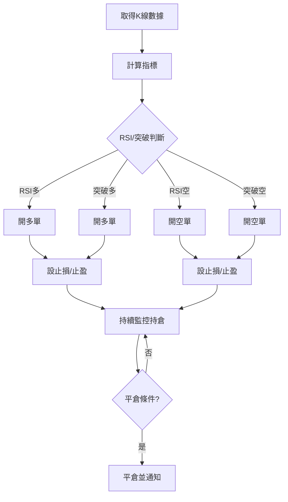

# 🚀 Bitunix 量化交易機器人（自動化合約交易）

---

## 📝 專案簡介

本專案是一套針對 **Bitunix 期貨交易所** 設計的全自動量化交易機器人，支援多因子策略（RSI 反轉、突破追漲），並整合 Discord 通知、風險控管、勝負統計、異常自動處理等功能。適合用於自動化交易、策略回測、實盤監控。

---

## 📦 專案架構

```
bitunix_cc/
├── bitunix_trading_bot.py   # 主程式，所有策略與交易邏輯
├── config.py                # 參數設定（API金鑰、策略、通知等）
├── stats.json               # 勝負統計自動儲存
├── requirements.txt         # 依賴套件清單
├── README.md                # 使用說明
└── ...
```

---

## ⚙️ 主要功能

- **多策略自動交易**：RSI 反轉、突破追漲，支援多單/空單
- **自動下單/平倉/止盈止損**：依策略自動判斷進出場，動態調整止盈止損
- **Discord Webhook 通知**：開倉、平倉、錯誤、勝負統計即時推播
- **勝負自動統計**：自動記錄每次交易結果，重啟不中斷
- **API 錯誤即時推播**：API 回傳錯誤、餘額不足等自動通知
- **參數化設計**：所有策略與交易參數皆可於 config.py 調整
- **完整異常處理與日誌**：所有操作皆有本地日誌與錯誤追蹤
- **自動還原狀態**：重啟後自動恢復持倉與統計

---

## 🧠 策略邏輯

### 進場邏輯
- **RSI 多單**：RSI < RSI_BUY 時，無持倉自動開多，設止損/止盈
- **RSI 空單**：RSI > rsiSell 時，無持倉自動開空，設止損/止盈
- **突破多單**：close > highestBreak 時，無持倉自動開多，設移動止損
- **突破空單**：close < lowestBreak 時，無持倉自動開空，設移動止損

### 出場邏輯
- **RSI 多單**：新K棒 RSI > EXIT_RSI 時平倉
- **RSI 空單**：新K棒 RSI < exitRSI_short 時平倉
- **突破單**：每輪動態調整移動止損，觸發即平倉

### 止盈止損
- **RSI 單**：止損/止盈 = 入場價 ± ATR×倍數，ATR 變動時自動更新
- **突破單**：僅設移動止損，隨價格推進

### 風控
- 僅允許同時一張單（多或空）
- 下單金額依錢包百分比與槓桿自動計算
- 失敗自動通知，API 回傳錯誤即時顯示

---

## 📲 Discord 通知
- **開倉/平倉/止盈/止損/錯誤**皆有即時推播
- 平倉時顯示 Bitunix 官方「實際盈虧」
- 勝率統計、持倉狀態、未實現盈虧一目了然
- 動態止盈止損調整不再推播，避免刷版

---

## 🛠️ 安裝與環境建置

### 1. Python 與虛擬環境
```bash
python -m venv .venv
.venv\Scripts\activate
pip install -r requirements.txt
```

### 2. TA-Lib 安裝
- 需先安裝 TA-Lib C 函式庫（Windows 請用 whl 檔安裝）
```bash
pip install TA_Lib‑*.whl
```

### 3. 設定 config.py
- 填入 Bitunix API 金鑰、交易對、策略參數、Discord Webhook 等

---

## ⚡ 執行流程
1. 啟動主程式 `python bitunix_trading_bot.py`
2. 載入 config 與勝負統計
3. 取得最新 K 線，計算指標
4. 依策略判斷是否進場/平倉/移動止損
5. 下單並設置止損止盈
6. 發送 Discord 通知
7. 進入主循環，每 20 秒自動重複檢查
8. 若遇到 API 錯誤、餘額不足等，立即推播並安全退出

---

## 🧩 config.py 參數說明
| 參數名稱 | 說明 | 範例 |
|----------|------|------|
| MARGIN_COIN | 保證金幣種 | "USDT" |
| BITUNIX_API_KEY | Bitunix API 金鑰 | "xxxx" |
| BITUNIX_SECRET_KEY | Bitunix Secret 金鑰 | "xxxx" |
| DISCORD_WEBHOOK_URL | Discord Webhook | "https://discordapp.com/api/webhooks/..." |
| TRADING_PAIR | 交易對 | "ETH/USDT" |
| SYMBOL | 交易符號 | "ETHUSDT" |
| LEVERAGE | 槓桿 | 20 |
| WALLET_PERCENTAGE | 每次下單佔錢包比例 | 0.1 |
| LOOP_INTERVAL_SECONDS | 主循環間隔秒數 | 20 |
| STOP_MULT | RSI單止損倍數 | 1.0 |
| LIMIT_MULT | RSI單止盈倍數 | 4.0 |
| RSI_BUY | RSI 進場閾值 | 47 |
| RSI_LEN | RSI 計算長度 | 12 |
| EXIT_RSI | RSI 平倉閾值 | 44 |
| BREAKOUT_LOOKBACK | 突破回看K棒數 | 3 |
| ATR_LEN | ATR 計算長度 | 12 |
| ATR_MULT | 突破單移動止損倍數 | 3.25 |
| TIMEFRAME | K棒週期 | "4h" |
| QUANTITY_PRECISION | 下單數量精度 | 4 |
| rsiSell | RSI 空單閾值 | 53 |
| exitRSI_short | RSI 空單平倉閾值 | 51 |

---

## ❓ 常見問題與排錯
- **TA-Lib 安裝失敗**：請先安裝 VC++ 14.0，並用 whl 檔安裝
- **API 連線錯誤**：檢查 API 金鑰、網路、防火牆
- **Discord 無法推播**：檢查 webhook 是否正確、頻道權限
- **Python/Windows 問題**：建議用 PowerShell 管理員模式執行
- **餘額不足/下單失敗**：會自動推播錯誤訊息，請檢查資金

---

## ⚠️ 風險警示與最佳實踐
- 請先於 Bitunix 測試網驗證策略
- 勿將全部資金投入單一策略
- API 金鑰請妥善保管，勿外洩
- 本程式僅供學術與研究，實盤請自行承擔風險

---

## 🏷️ 版權與免責聲明
- 本專案原始碼開放學習用途，嚴禁用於非法用途
- 交易有風險，請自行評估與承擔損失
- 作者不對任何因使用本程式造成的損失負責

---

## 📊 策略流程圖


---

> **建議：**
> - 先於 Bitunix 測試網驗證策略
> - 觀察 Discord 通知與實際盈虧是否一致
> - 定期備份 config.py 與 stats.json
> - 有問題請於 GitHub issue 留言

